# Simple Docker-like Container Runtime in Python

## Introduction

This project is a simple Docker-like container runtime implemented in Python. It's intended **for learning purposes**, to help understand how Docker works under the hood. Honestly, I'm not entirely sure if this is exactly how Docker operates in the background, but my main goal was to explore how to pull and run a Docker image.

This application allows you to:

- **Pull Docker images** from Docker Hub.
- **Run containers** with isolated namespaces, limited resources, and custom networking.

## Prerequisites

- **Python 3.x**
- **Root privileges** (required for the `run` command)
- Linux system with support for namespaces, cgroups, and networking features
- **Python Libraries**:
  - `requests` (install with `pip install requests`)
- **System Utilities**:
  - `ip` (from `iproute2`)
  - `nsenter`
  - `iptables`
  - `mount`
  - `chroot`

## Usage

### Pulling an Image

To pull a Docker image from Docker Hub, use the `pull` command:

```bash
python3 main.py pull library/ubuntu:latest
```

This command will:

- Authenticate with Docker Hub to retrieve an auth token.
- Fetch the image manifest and select the appropriate layers for your platform.
- Download and extract the image layers to create the root filesystem at `.images/library/ubuntu/latest`.

### Running a Container

To run a container using the pulled image, use the `run` command:

```bash
sudo python3 main.py run library/ubuntu:latest
```

**Important**: The `run` command must be executed with `sudo` or as the root user because it needs to:

- Create new namespaces (UTS, mount, PID, network).
- Set resource limits using cgroups.
- Configure network interfaces and iptables rules.

When you run this command, the application will:

- Isolate the container environment from the host.
- Set up a new root filesystem using the pulled image.
- Limit CPU resources.
- Configure networking with a virtual ethernet pair and NAT.
- Start a shell (`/bin/sh`) inside the container.

### Exiting the Container

To exit the container shell, type `exit` or press `Ctrl+D`. The application will:

- Clean up cgroups.
- Remove network interfaces and iptables rules.
- Unmount filesystems and revert any changes made during setup.

## How It Works

### Workflow Overview

#### Pulling an Image

1. **Authentication**: Retrieves an authentication token from Docker Hub for the specified image.
2. **Fetching Manifest**: Downloads the image manifest, handling multi-architecture images by selecting the appropriate one for your system.
3. **Downloading Layers**: Downloads each layer of the image.
4. **Extracting Layers**: Extracts the layers to create the root filesystem for the container.

#### Running a Container

1. **Namespace Isolation**: Uses `unshare` to create new namespaces, isolating the container's environment.
2. **Filesystem Setup**: Uses `chroot` to change the root directory to the image's root filesystem.
3. **Resource Limitation**: Sets up cgroups to limit CPU usage.
4. **Networking**: Creates a virtual ethernet pair to provide network access, configures IP addresses, and sets up NAT.
5. **Process Execution**: Starts a shell inside the container, acting as the container's init process.

### Workflow Diagram

```mermaid
flowchart TD
    subgraph Pulling an Image
        A1[Start Pull Command] --> B1[Get Auth Token]
        B1 --> C1[Fetch Manifest]
        C1 --> D1{Manifest Type}
        D1 -- Multi-arch --> E1[Select Platform Manifest]
        D1 -- Single-arch --> F1[Proceed]
        E1 --> F1
        F1 --> G1[Download Layers]
        G1 --> H1[Extract Layers]
        H1 --> I1[Image Ready]
    end

    subgraph Running a Container
        A2[Start Run Command] --> B2[Check Root Privileges]
        B2 --> C2[Unshare Namespaces]
        C2 --> D2[Set Hostname]
        D2 --> E2[Setup Filesystem]
        E2 --> F2[Mount /proc]
        F2 --> G2[Limit Resources with cgroups]
        G2 --> H2[Setup Networking]
        H2 --> I2[Start Shell in Container]
        I2 --> J2[Container Running]
    end
```



## Detailed Steps

### Pull Command

1. **Start Pull Command**: You initiate the pull process with `python3 main.py pull <image>`.
2. **Get Auth Token**: The application requests an authentication token from Docker Hub.
3. **Fetch Manifest**: It retrieves the image manifest, which may contain multiple architectures.
4. **Select Platform Manifest**: If the manifest is multi-architecture, it selects the one matching your system.
5. **Download Layers**: It downloads each layer of the image.
6. **Extract Layers**: Layers are extracted to create the root filesystem.
7. **Image Ready**: The image is now ready for use.

### Run Command

1. **Start Run Command**: You start the container with `sudo python3 main.py run <image>`.
2. **Check Root Privileges**: The application ensures it has root access.
3. **Unshare Namespaces**: It creates new UTS, mount, PID, and network namespaces.
4. **Set Hostname**: The container's hostname is set to `simple-container`.
5. **Setup Filesystem**: The root filesystem is changed to the image's filesystem using `chroot`.
6. **Mount /proc**: The `/proc` filesystem is mounted inside the container.
7. **Limit Resources with cgroups**: CPU usage is limited to 10% of a single core.
8. **Setup Networking**: Virtual ethernet interfaces are created and configured.
9. **Start Shell in Container**: A shell is started inside the container.
10. **Container Running**: The container is now up and running.

## Why Root Privileges Are Required

The `run` command requires root privileges because it performs operations that are restricted to the root user:

- **Namespace Management**: Creating new namespaces (PID, network, etc.) using `unshare`.
- **Resource Limitation**: Setting up cgroups to limit CPU usage.
- **Filesystem Operations**: Changing the root directory with `chroot`.
- **Networking**: Configuring network interfaces, setting IP addresses, and modifying iptables rules.

Attempting to perform these actions without root privileges will result in permission errors.
